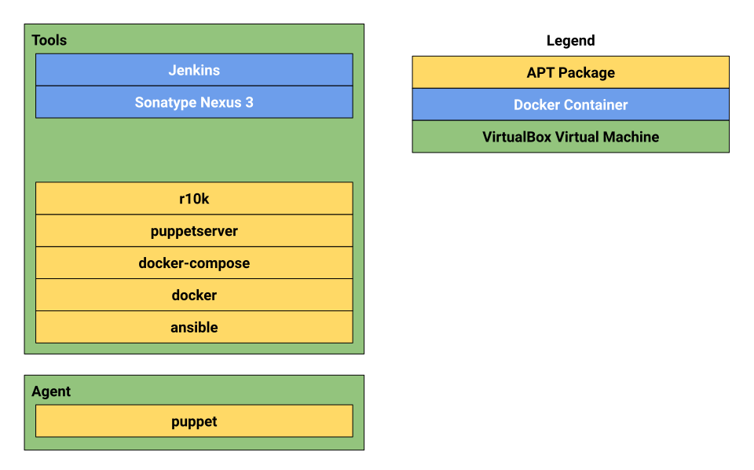

#  Dilopez DevOps #
This repository provides tools for testing, building, packaging, provisioning 
and orchestrating software as well as monitoring infrastructure.

## System Requirements ## 

* 4GB RAM
* Virtualization-enabled CPU

## Dependencies ##
This development is meant to be deployed on a local machine with the following 
software installed:

* VirtualBox
* Vagrant 

## Tools ## 
The following diagrams shows the different tools included and how they are 
distributed.

* The APT packages are provisioned on each Vagrant file.

## Installation ##
### Creating Virtual Machines ###
We are using Vagrant to create virtual machines. Two virtual machies will be created:
* master
* agent

To create the virtual machines, run from the repository root directory:
* `./install.sh` 
* You will need to choose your bridged network interface for each virtual machine
  * Please ensure the both interfaces are the same.
* After the installation is finished, your should be able to access to the virtual machines:
  * Enter the virtual machine folder via terminal
  * run `vagrant ssh`
